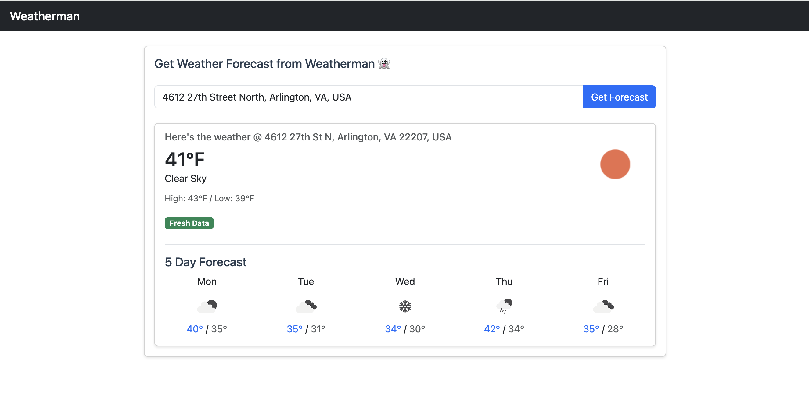

# Weatherman is the best type of man! 👻



## Try it out!
👉 [Live Demo](https://weatherman-a1eb1a0fb833.herokuapp.com/) 


## Features
- Location search with Google Places Autocomplete
- Current weather conditions
- 5 day forecast
- 30 min forecast caching
- Cache status indicator

## Setup

### Requirements
- Ruby 3.2.x
- Rails 7.x
- SQLite (dev)
- PostgreSQL (prod)

### Installation

1. Clone and install dependencies

```console
git clone https://github.com/zachhajjaj/weatherman.git
cd weatherman
bundle install
```


2. Set up environment variables
Create a `.env` file and add your API keys:

GOOGLE_PLACES_API_KEY=your_key_here
WEATHER_API_KEY=your_key_here


3. Set up database

```console
rails db:create db:migrate
```


4. Start the server

```console
rails s
```

## Architecture

### Decomposition

#### Forecast Model
- **Purpose**: Central model for weather info
- **Attributes**:
  - `zip_code`: Location identifier for caching
  - `temperature`: Current temp
  - `temp_min/temp_max`: Daily temp range
  - `description`: Weather condition description
  - `icon`: Weather condition icon code
  - `latitude/longitude`: Location coordinates
  - `address`: Formatted address string
  - `extended_forecast`: 5 day forecast data (serialized JSON)
- **Methods**:
  - `cached_by_zip`: Finds cached forecasts by zip code
  - `cache_status`: Determines if data is from cache

#### WeatherService
- **Purpose**: Handles OpenWeatherMap API interactions
- **Methods**:
  - `get_forecast`: Fetches current and extended forecast
  - `get_current_weather`: Retrieves current conditions
  - `get_extended_forecast`: Gets 5 day forecast data

#### GeocodeService
- **Purpose**: Manages Google Geocoding API interactions
- **Methods**:
  - `get_coordinates`: Converts address to coordinates and zip
  - `extract_zip_code`: Parses zip from address components
  - `fetch_nearest_zip_code`: Finds closest zip using reverse geocoding

#### ForecastsController
- **Purpose**: Handles web requests and coordinates services
- **Methods**:
  - `create`: Main workflow for getting/caching forecasts
  - `render_forecast`: Displays weather data
  - `render_error`: Error handeling

### Design Choices
- Simple, focused service objects
- Efficient caching strategy
- Clean, responsive UI with Bootstrap
- Turbo for smooth updates and SPA feel

### Flow
1. User enters address → Google Places Autocomplete
2. Address → GeocodeService → Coordinates + Zip
3. Check cache for existing forecast
4. If not cached → WeatherService → Fresh forecast
5. Store forecast and display to user - hoooray! 😜